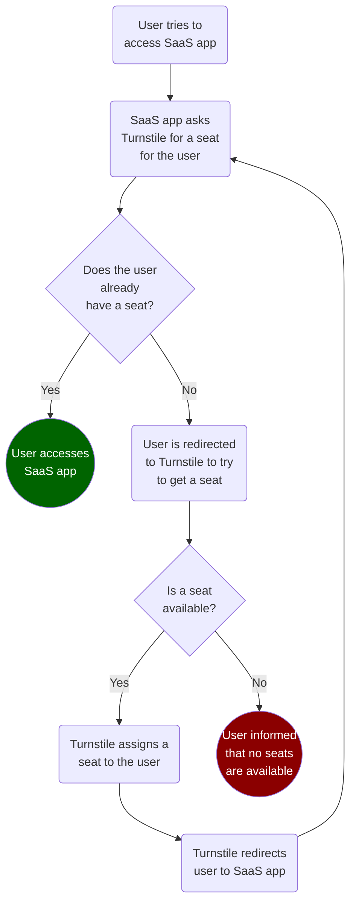
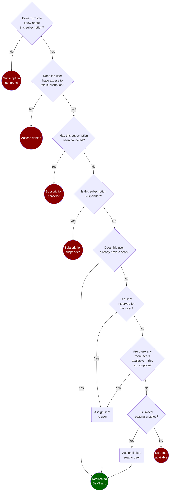

# Turnstile

Turnstile simplifies the building of SaaS apps on Azure by automating subscription and seat (or license) management. Turnstile is deployed into your own Azure environment and is designed to work with any SaaS app regardless of development stack or architecture.

## Contents

* [How we talk about SaaS](#how-we-talk-about-saas)
* [How Turnstile works](#how-turnstile-works)
  * [How Turnstile assigns seats to your users](#how-turnstile-assigns-seats-to-your-users)
* [Deploying Turnstile](#deploying-turnstile)
* [Contributing](#contributing)
* [Trademarks](#trademarks)

## How we talk about SaaS

Before we dive deeper into how Turnstile works, let's first establish a common vocabulary.

__Customers__ (represented in your SaaS app as __tenants__) purchase __subscriptions__ to your SaaS app. A __subscription__ may include a predefined number of __seats__ (or licenses) that __users__ can obtain to access your SaaS app.

## How Turnstile works

When a user tries to access your SaaS app, your app first calls an API endpoint that Turnstile exposes to check if the user already has a seat. If the user does not  have a seat, your SaaS app redirects the user to Turnstile to try to obtain one as illustrated in the diagram below. 



### How Turnstile assigns seats to your users

Turnstile exposes two endpoints to users trying to access a subscription —

* __The default turnstile.__ This endpoint is located at the root of the Turnstile web app. Turnstile first checks to see which active subscriptions the user has access to. If the user has access to more than one subscription, Turnstile displays a list of subscriptions for the user to choose from. When a user chooses a subscription, they're redirected to that subscription's __specific turnstile__. If the user only has access to one subscription, the user is automatically redirected to that subscription's __specfic turnstile__.
* __The specific turnstile.__ This endpoint is located at `/turnstile/{subscription_id}` where `{subscription_id}` is the ID of the subscription the user is trying to access. This endpoint executes the workflow illustrated below on behalf of the user to try and obtain them a seat.



## Deploying Turnstile

> ✋🏼 **Wait!** Will you be selling your SaaS app through [the Microsoft commercial marketplace (Azure Marketplace or AppSource)?](https://azure.microsoft.com/publish-your-app/) [Mona ([**M**]arketplace [**On**]boarding [**A**]ccelerator)](https://github.com/microsoft/mona-saas) is another Microsoft-hosted open source project that makes it easy to integrate your SaaS app with the Microsoft commercial marketplace. Mona and Turnstile are designed to work together to provide a complete SaaS onboarding solution for transactability and seat/subscription management. The Mona repository [contains a setup script](#) that automatically deploys both Mona and Turnstile into your Azure environment and configures the two to work together. Specifically, Mona is configured to forward new subscription purchases and [Marketplace webhook notifications](https://docs.microsoft.com/azure/marketplace/partner-center-portal/pc-saas-fulfillment-webhook) to Turnstile.

### 1. Prerequisites

First, ensure that the following prerequisites are met.

 * You have an active Azure subscription. [If you don't already have one, get one free here](https://azure.microsoft.com/free).
 * You have the ability to create new app registrations within your Azure Active Directory (AAD) tenant. In order to create app registrations, you must be a directory administrator. For more information, see [this article](https://docs.microsoft.com/en-us/azure/active-directory/roles/permissions-reference).
 * You have the ability to create resources and resource groups within the target Azure subscription. Typically, this requires at least [contributor-level access](https://docs.microsoft.com/azure/role-based-access-control/built-in-roles#contributor) to the subscription.

### 2. Clone this repository

Navigate to [the Azure portal](https://portal.azure.com) and [launch the Bash cloud shell](https://docs.microsoft.com/azure/cloud-shell/quickstart#start-cloud-shell).
 
 > If this is the first time that you've used the cloud shell, you will be prompted to [create or choose an existing an Azure Files share](https://docs.microsoft.com/azure/cloud-shell/overview#connect-your-microsoft-azure-files-storage).

Run this command from the cloud shell to clone this repository —

```shell
git clone https://github.com/microsoft/turnstile
```

Navigate to the setup folder by running —

```shell
cd ./turnstile/Turnstile/Turnstile.Setup
```

Finally, allow the setup script to be executed locally by running —

```shell
chmod +x ./setup_turnstile.sh
```

### 3. Set up Turnstile

At a minimum, you need this information before running the setup script —

* [The Azure region](https://azure.microsoft.com/global-infrastructure/geographies/) in which you wish to deploy Turnstile.
    * For a complete list of available regions, run `az account list-locations -o table` from the cloud shell. Be sure to use the region's `Name`, not `DisplayName` or `RegionalDisplayName`.
* An arbitrary, globally-unique name for this Turnstile deployment.
    * This identifier must consist of lowercase alphanumeric characters (a-z, 0-9) _only_.
    * It must also be between 3 and 13 characters in length.
* A friendly display name for your Turnstile deployment which your customers will see when authenticating to Turnstile. Although a display name isn't technically required, it's highly recommended.

To setup Turnstile, run —

```shell
 # Broken down into multiple lines for readability...
 
 ./setup_turnstile.sh \
    -r "replace with your Azure region" \
    -n "replace with the name of your Turnstile deployment" \
    -d "replace with the display name of your Turnstile deployment"
```

### 4. Complete Turnstile setup

Once the script is finished, note the information provided in the `Turnstile Deployment Summary`. We strongly recommend saving these values somewhere safe and convenient as you will likely need to refer to them again later.

Locate the setup URL at the _very bottom_ of the script output. It will look similiar to this —

```shell
https://turn-web-example01.azurewebsites.net/publisher/setup

# Where "example01" is the Turnstile deployment name.
```

Click the URL (it's automatically linked within the cloud shell) to navigate to that site and complete the Turnstile setup wizard.

> The setup wizard is hosted entirely within your own Turnstile deployment so you're aren't sharing any information with Microsoft (or anyone else) at this point.

## Contributing

This project welcomes contributions and suggestions.  Most contributions require you to agree to a
Contributor License Agreement (CLA) declaring that you have the right to, and actually do, grant us
the rights to use your contribution. For details, visit https://cla.opensource.microsoft.com.

When you submit a pull request, a CLA bot will automatically determine whether you need to provide
a CLA and decorate the PR appropriately (e.g., status check, comment). Simply follow the instructions
provided by the bot. You will only need to do this once across all repos using our CLA.

This project has adopted the [Microsoft Open Source Code of Conduct](https://opensource.microsoft.com/codeofconduct/).
For more information see the [Code of Conduct FAQ](https://opensource.microsoft.com/codeofconduct/faq/) or
contact [opencode@microsoft.com](mailto:opencode@microsoft.com) with any additional questions or comments.

## Trademarks

This project may contain trademarks or logos for projects, products, or services. Authorized use of Microsoft 
trademarks or logos is subject to and must follow 
[Microsoft's Trademark & Brand Guidelines](https://www.microsoft.com/en-us/legal/intellectualproperty/trademarks/usage/general).
Use of Microsoft trademarks or logos in modified versions of this project must not cause confusion or imply Microsoft sponsorship.
Any use of third-party trademarks or logos are subject to those third-party's policies.
