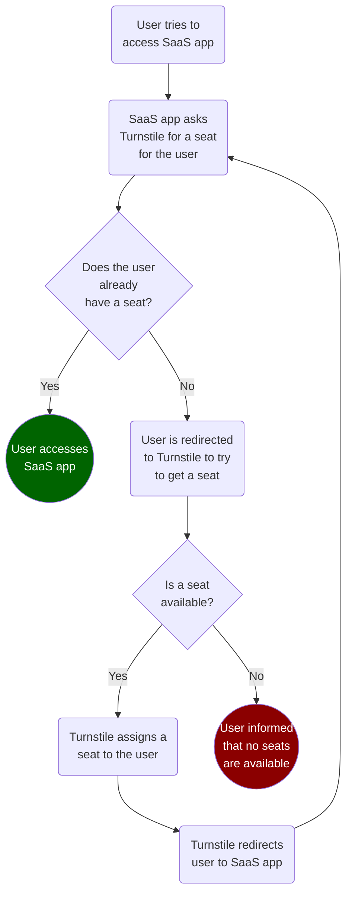
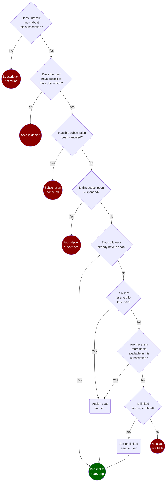

# Turnstile

Turnstile simplifies the process of building SaaS apps on Azure by automating subscription and seat (or license) management. It's deployed into your own Azure environment and is designed to work with any SaaS app regardless of development stack or architecture.

## How we talk about SaaS

Before we dive deeper into how Turnstile works, let's first establish a common vocabulary.

__Customers__ (represented in your SaaS app as __tenants__) purchase __subscriptions__ to your SaaS app. A __subscription__ may or may not include a predefined number of __seats__ (or licenses) that __users__ can obtain to access your SaaS app. Turnstile simplifies this process by automating and externalizing the management of __subscriptions__ and the provisioning of __seats__. 

## How Turnstile works

When a user tries to access your SaaS app, your SaaS app calls a simple API endpoint that Turnstile exposes to determine whether or not the user already has a seat. If the user does not already have a seat, your SaaS app redirects the user to Turnstile to try to obtain one as illustrated in the diagram below. 

### How Turnstile assigns seats to your users

If the user's tenant has more than one subscription, the user is first prompted to choose which subscription they're trying to access. Once the user has selected a subscription, Turnstile runs the workflow below to try and get that user a seat.

> If the tenant only has one subscription (likely the most common use case), this workflow is run immediately on that subscription for the user. Usually, the user trying to get a seat from Turnstile will see no Turnstile user interface at all; Turnstile simply tries to get the user a seat then redirects them based on the result of this workflow.

## Contributing

This project welcomes contributions and suggestions.  Most contributions require you to agree to a
Contributor License Agreement (CLA) declaring that you have the right to, and actually do, grant us
the rights to use your contribution. For details, visit https://cla.opensource.microsoft.com.

When you submit a pull request, a CLA bot will automatically determine whether you need to provide
a CLA and decorate the PR appropriately (e.g., status check, comment). Simply follow the instructions
provided by the bot. You will only need to do this once across all repos using our CLA.

This project has adopted the [Microsoft Open Source Code of Conduct](https://opensource.microsoft.com/codeofconduct/).
For more information see the [Code of Conduct FAQ](https://opensource.microsoft.com/codeofconduct/faq/) or
contact [opencode@microsoft.com](mailto:opencode@microsoft.com) with any additional questions or comments.

## Trademarks

This project may contain trademarks or logos for projects, products, or services. Authorized use of Microsoft 
trademarks or logos is subject to and must follow 
[Microsoft's Trademark & Brand Guidelines](https://www.microsoft.com/en-us/legal/intellectualproperty/trademarks/usage/general).
Use of Microsoft trademarks or logos in modified versions of this project must not cause confusion or imply Microsoft sponsorship.
Any use of third-party trademarks or logos are subject to those third-party's policies.
